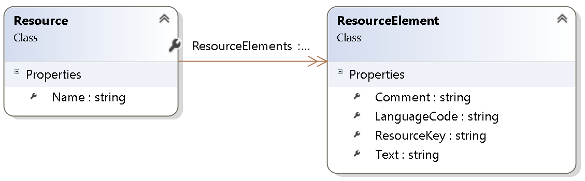

#  TeaForResource
T4 Template Generation for C# Resource Files

## The Problem

Microsoft provides Resource Files (\*.resx) for holding language dependent strings and Visual Studio automatically generates resource class files. 
With these generated files you can easily access language dependent strings. But if you have to share your language dependent strings over network boundaries you mostly need to transfer individual resource keys as a *magic string*.  
This is error prone and annoying in case of type errors. In order to ship arround this problem you can create a static class, that stores your resource keys and provides you with intellisense. But it is a lot of work for creating and maintaining this class.

With **TeaForResource** you can automatically generate this static class and other useful files (e.g. typescript) for your purpose.

## Advantages of T4 Templates
- T4 Templates are fully integrated in Visual Studio.
- Easy installation, as you just need to copy some files into your project.
- It does not pollute your own project.
- You can modify or extend the templates for your own purposes.
- Available Visual Studio Plugins for T4 Template development (e.g. *[T4 Editor from Devart](https://www.devart.com/t4-editor/)*, Resharper Plugin *[TeaFor](https://resharper-plugins.jetbrains.com/packages/ForTea/)* )
- Automatically regenarate on build

## Content

**TeaForResource** consists of two parts:

- The core file (*\Resources\TeaForResource.Core.ttinclude*) with plain C# code to read your Resource Files 
- The T4 template files (*\Resources\ResourceKeys.tt*, ...) that generates the output.

## Installation

### Install Sample Project 
1. Clone the project
2. Open the Visual Studio Solution file (*TeaForResource.sln*)
3. Run T4 Template generation (e.g. from VS menu: Build->Transform All T4 Templates)
4. Check the generated files for the Sample Resources (*[\Resources\ResourceKeys.generated.cs](docs/images/ResourceKeys.generated.cs.png)*, *[\Typescript\text.resources.generated.ts](docs/images/text.resources.generated.ts.png)*)

### Use it in your own Project

1. Copy the core file and T4 template files to your project wherever you need it.
2. Optionally rename the T4 template files for your needs.
3. Set the reference path to the core file in your T4 template. (see configuration section)
3. Adapt configuration parameters in T4 template files. (see configuration section)
4. Optionally add *.generated.cs, *.generated.ts to your .gitignore file.

## Configuration

### Reference to .ttinclude file

The first line in the T4 Template references the core file.
`<#@ include file="TeaForResource.Core.ttinclude" #>`   
Adapt the path correctly, for example 
`<#@ include file="$(SolutionDir)\MyProject\Resources\TeaForResource.Core.ttinclude" #>`

### Settings

Each T4 Template file has a *settings* section with parameters.

##### ResourceKeys.tt

+ ResourcePath -> Path to your resource files (*.resx)
+ StaticResourceNamespaceName -> Namespace of your static resource class

##### text.resources.tt

+ ResourcePath  -> Path to your resource files (*.resx)
+ TextResourceModuleName -> Module name of your generated typescript file
+ TextResourceClassName -> Class name of your generated resource class

----

# Extensibility

You can also write your own T4 templates and generate individual output,
by using the *TeaForResource.Core.ttinclude* file.

### TeaForResource.Core.ttinclude

#### Basic functionality

The ReadResource Method tries to find all your resource files in the configured folder(s).  
It groups them by the resource name itself and then reads these groups for all languages in parallel.   
As the resource file with the default language by convention contains no suffix, you must specify the
language Suffix (e.g. "en" or "en-US" for english).   
In the end it returns a class structure with the most important information from your resource files.  

#### Output Class Diagram

##### Resource Class

- Name -> Name of your resource file
- ResourceElements -> List of ResourceElement classes

##### ResourceElement Class

- ResourceKey -> Resource key from your resx file
- Text -> Language dependent text of resx file
- LanguageCode -> Iso language code from your .resx file extension (e.g. xxx.en-US.resx -> en-US)
- Comment -> Comment of your resource Entry

---
# Links

 [MSDN (T4)](https://msdn.microsoft.com/en-us/library/bb126445.aspx)   
 [Wikipedia](https://en.wikipedia.org/wiki/Text_Template_Transformation_Toolkit)   
 [T4 Template Tutorials and Solutions](http://t4-editor.tangible-engineering.com/How-Do-I-With-T4-Editor-Text-Templates.html)   
 [Pluralsight Course (T4)](https://www.google.ch/url?sa=t&rct=j&q=&esrc=s&source=web&cd=1&cad=rja&uact=8&ved=0ahUKEwiNir60xYzRAhUD6CwKHQdSA8sQFggaMAA&url=https%3A%2F%2Fwww.pluralsight.com%2Fcourses%2Ft4-templates&usg=AFQjCNG4s8OCMFP1bfkSqOIi8S1YL9cwBw&bvm=bv.142059868,d.bGg)

